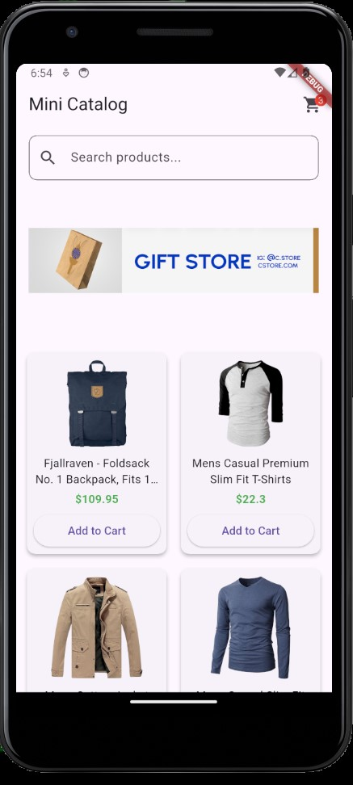
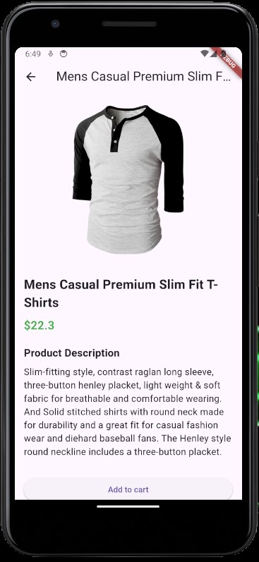
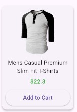
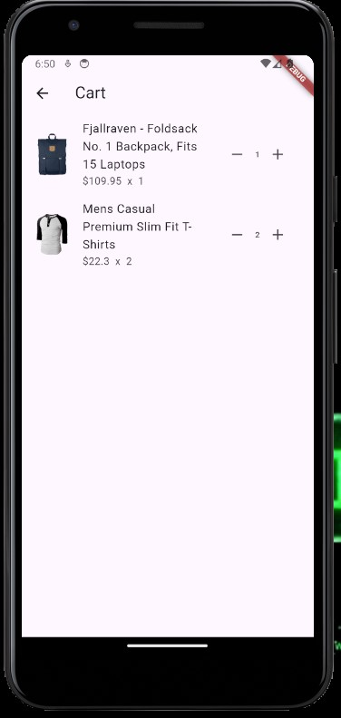

# Mini Katalog Uygulaması

**Kısa Açıklama:**  
Flutter kullanılarak geliştirilmiş basit bir mobil katalog uygulamasıdır.  
- Ürün listesi ve detay ekranı  
- Sepet ve checkout sistemi  
- Arama çubuğu ve banner görseli

**Kullanılan Flutter Sürümü:**  
Flutter 3.38.9 (stable)  
**Dart Sürümü:** Dart 3.10.8

## Çalıştırma Adımları

1. Flutter SDK kurulu olmalı  
2. Terminalde proje klasörüne git  
3. Paketleri yükle:

    flutter pub get

4. Emulator veya cihazı başlat  
5. Uygulamayı çalıştır:

    flutter run

## Ekran Görüntüleri (Screenshots)

  

  
